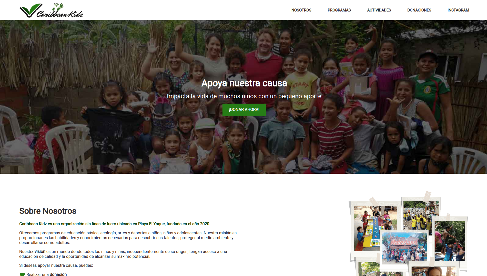

# CaribbeanKidz



[Caribbean Kidz](https://caribbean-kidz.web.app/) is an NGO (Not-for Profit Organization) based in El Yaque, Margarita. It is dedicated to offering educational programs to children at no cost. The programs cover the following subjects: 

- Primary & lower secondary education
- Environmental education
- Sports


The website 
https://caribbean-kidz.web.app/ is a donation that I have made to the Caribbean Kidz team to help them increase awareness in Margarita and the world, and to improve their online presence for fund-raising.


## Getting Started

### Requirements

- GIT
- Python ^v3

### Installation

1) Clone the repository
```bash
git clone git@github.com:jesusgraterol/caribbeankidz.git
```

## Usage

1) Run a local server with:

```bash
python3 -m http.server --directory src
```

2) The website is served at: [http://localhost:8000/](http://localhost:8000/)


## Build Process

N/A


## Deployment

[Firebase Hosting](https://firebase.google.com/docs/hosting/quickstart)


## Built With

- HTML5
- CSS3
- JavaScript

## Running the Tests

### Unit Tests

N/A

### Integration Tests

N/A

### E2E Tests

N/A

## @TODO

- Optimize the distribution of the website with a bundler or a task runner

## License

[MIT](https://choosealicense.com/licenses/mit/)

## Acknowledgments

- [Google Fonts](https://fonts.google.com/icons)


## Branding

**Font:** Roboto | Normal | 400

**Primary Color:** #0D4409

**Accent Color:** #267D16